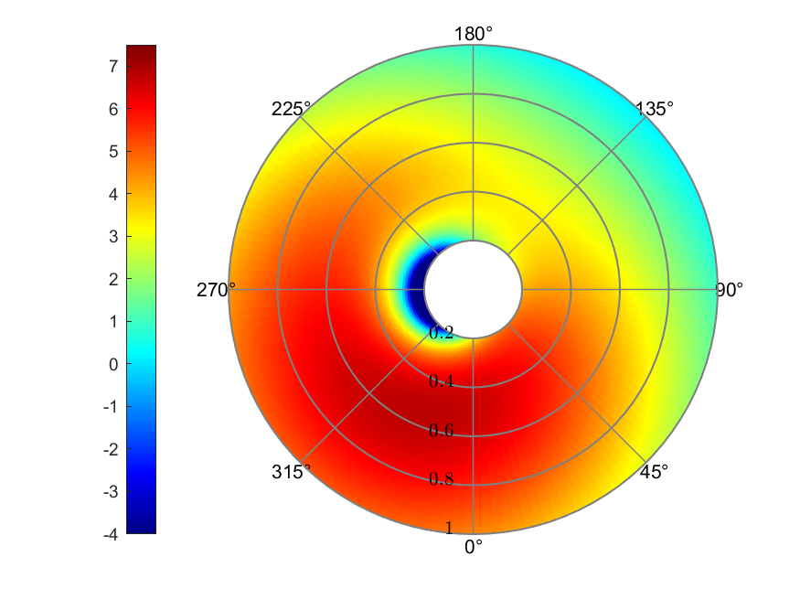
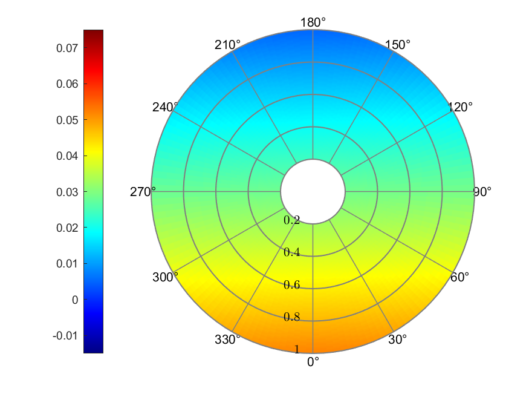

# Inflow Models for Blade Element Momentum Theory in Forward Flight

An assignment for the course FLIGHT DYNAMICS AND AEROELASTICITY OF ROTARY-WING AIRCRAFT of Politecnico di Milano

'polarPcolor' function thanks to the contribution of @ECheynet, 
[polarPcolor github page.](https://github.com/ECheynet/polarPcolor)

**Qiuyang Xia**

## Abstract

In this report, blade element momentum theory is briefly introduced.
Momentum theory is utilized to first determine the inflow distribution
of the rotor during a forward flight scenario, and then blade element
analysis is used to calculate the thrust coefficient of each blade
element. The reference blade airfoil is NACA0012, and the blade
parameters and flight configurations are taken from a NASA experiment
conducted in 1988. Several different inflow models tested in this report
including uniform inflow model and various linear inflow model. Results
showed the thrust coefficient distribution varies in terms of different
inflow model, but correspond to a similar trend.

## Method

### Uniform Inflow Model Derived from Momentum Analysis

During forward flight, the rotor disk is tilted forward by an angle
$\alpha$. The geometric and force analysis is shown in Figure 1:

**Figure 1. Glauert\'s flow model for the momentum analysis of a rotor in forward flight.**

where $V_{\infty}$ being infinite distance flow, $v_{i}$ being induced
velocity perpendicular to the rotor disk, and $w$ being induced velocity
at far wake.

Glauert made the hypothesis of mass inflow:

$$\dot{m} = \rho AU$$

where $\rho$ is the air density, $A$ is the rotor area, and $U$ is the
resultant velocity at the disk:

$$U = \sqrt{\left( V_{\infty}\cos\alpha \right)^{2} + \left( V_{\infty}\sin\alpha + v_{i} \right)^{2}} = \sqrt{V_{\infty}^{2} + 2V_{\infty}v_{i}\sin\alpha + v_{i}^{2}}$$

With the conservation of momentum, we can get:

$$\dot{m}\left( V_{\infty}\sin\alpha + w \right) - \dot{m}V_{\infty}\sin\alpha = \dot{m}w = T$$

From the energy conservation, we can get:

$$\frac{1}{2}\dot{m}\left( V_{\infty}\sin\alpha + w \right)^{2} - \frac{1}{2}\dot{m}V_{\infty}^{2}\sin^{2}\alpha = \frac{1}{2}\dot{m}\left( 2V_{\infty}w\sin\alpha + w^{2} \right) = P = T\left( V_{\infty}\sin\alpha + v_{i} \right)$$

From which we can get the relationship between $w$ and $v_{i}$:

$$2V_{\infty}\sin\alpha + w = 2\left( V_{\infty}\sin\alpha + v_{i} \right)$$

$$w = 2v_{i}$$

Thus, total thrust can be expressed as follows:

$$T = 2\dot{m}v_{i} = 2\rho AUv_{i} = 2\rho Av_{i}\sqrt{V_{\infty}^{2} + 2V_{\infty}v_{i}\sin\alpha + v_{i}^{2}}$$

Since hovering induced velocity can be expressed as:

$$v_{h}^{2} = \frac{T}{2\rho A}$$

the induced velocity can be expressed as:

$$v_{i} = \frac{v_{h}^{2}}{\sqrt{\left( V_{\infty}\cos\alpha \right)^{2} + \left( V_{\infty}\sin\alpha + v_{i} \right)^{2}}}$$

Defining the advance ratio and the inflow ratio in forward flight as
$\mu$ and $\lambda$ respectively, we have:

$$\mu = \frac{V_{\infty}\cos\alpha}{\Omega R}$$

$$\lambda = \frac{V_{\infty}\sin\alpha + v_{i}}{\Omega R} = \mu\tan\alpha + \lambda_{i}$$

From the equations above, the induced inflow ratio can be expressed as:

$$\lambda_{i} = \frac{\lambda_{h}^{2}}{\sqrt{\mu^{2} + \lambda^{2}}} = \frac{C_{T}}{\sqrt{\mu^{2} + \lambda^{2}}}$$

Thus, we get an implicit expression of inflow ratio:

$$\lambda = \mu\tan\alpha + \frac{C_{T}}{\sqrt{\mu^{2} + \lambda^{2}}}$$

### Linear Inflow Model

In-flight experimental observations at higher advancing speed
($\mu > 0.15$) have shown that the longitudinal and lateral inflow
variation is approximately linear, which can be expressed as:

$$\lambda_{i} = \lambda_{0}\left( 1 + k_{x}\frac{x}{R} + k_{y}\frac{y}{R} \right) = \lambda_{0}\left( 1 + k_{x}r\cos\psi + k_{y}r\sin\psi \right)$$

In this equation, $\lambda_{0}$ is the mean induced velocity at the
center of the rotor as given by the uniform momentum theory. $k_{x}$ and
$k_{x}$ can be viewed as weighting factors and represent the deviation
of the inflow from the uniform value predicted by the simple momentum
theory. $\psi$ is the blade azimuth position angle.

Various researchers suggested different value couples for the
coefficients in the linear inflow model, which is summarized in Table 1.

**Table 1. Various Estimated Values of First Harmonic Inflow**

| Author(s)             | $k_{x}$                                                                  | $k_{y}$ |
| :-------------------- | :----------------------------------------------------------------------- | :------ |
| Coleman et al. (1945) | $\frac{\tan\chi}{2}$                                                     | $0$     |
| Drees (1949)          | $\frac{4}{3}\frac{1 - \cos\chi - 1.8\mu^{2}}{\sin\chi}$                  | $-2\mu$ |
| Payne (1959)          | $\frac{4}{3}\frac{\mu}{\lambda\left( 1.2 + \frac{\mu}{\lambda} \right)}$ | $0$     |
| White & Blake (1979)  | $\sqrt{2}\sin\chi$                                                       | $0$     |
| Pitt & Peters (1981)  | $\frac{15\pi}{23}\tan\frac{\chi}{2}$                                     | $0$     |
| Howlett (1981)        | $\sin^{2}\chi$                                                           | $0$     |

### Blade Element Analysis in Forward Flight

A few blade element assumptions are made for the analysis. First, the
aerodynamic characteristics of blade sections are independent. And
second, the radial component of velocity does not affect lift an drag.
Small angles assumption is also utilized in literature, but since the
calculation in this report is conducted by PC, this assumption is
neglected.

Figure 2 shows a typical blade element for analysis. The $U_{R}$ is the
radial component of velocity, which is neglected in this analysis.

**Figure 2. Incident velocities and aerodynamic environment at a typical blade element.**

$U_{T}$ is the in-plane component of the resultant local flow velocity:

$$U_{T} = \Omega y + \mu\Omega R\sin\psi$$

and $U_{P}$ is the out-of-plane component.

$$U_{P} = \lambda\Omega R + y\dot{\beta} + \mu\Omega R\beta\cos\psi$$

Therefore, the resultant velocity at the blade element is:

$$U = \sqrt{U_{T}^{2} + U_{P}^{2}}$$

The induced angle of attack, or the relative inflow angle $\phi$ at the
blade element will be:

$$\phi = \tan^{- 1}\frac{U_{P}}{U_{T}}$$

If the pitch angle at the blade element is $\theta$, the the aerodynamic
effective angle of attack $\alpha$ (different from shaft tilt angle) is:

$$\alpha = \theta - \phi$$

If the lift and drag coefficient is a function of effective angle of
attack, they can be expressed as follows respectively:

$$C_{l} = C_{l\alpha}\alpha$$

$$C_{d} = C_{d\alpha}\alpha$$

Thus, the resultant incremental lift $dL$ and drag $dD$ per unit span on
the blade element are:

$$dL = \frac{1}{2}\rho U^{2}cC_{l}dy$$

$$dD = \frac{1}{2}\rho U^{2}cC_{d}dy$$

where $c$ is the local blade chord.

Referring to Figure 2, the forces perpendicular and parallel to the
rotor disk can be resolved respectively as:

$$dF_{z} = dL\cos\phi - dD\sin\phi$$

$$dF_{x} = dL\sin\phi + dD\cos\phi$$

Therefore, the blade element contributions to the thrust, torque, and
power of the rotor are:

$$dT = N_{b}dF_{z}$$

$$dQ = N_{b}dF_{x}y$$

$$dP = N_{b}dF_{x}\Omega y$$

where $N_{b}$ is the number of blades.

For conveniently analyze, the non-dimensional quantities are introduced
as follows:

$$dC_{t} = F  \frac{dT}{\rho A(\Omega R)^{2}}$$

$$dC_{q} = F  \frac{dQ}{\rho A(\Omega R)^{2}R}$$

$$dC_{p} = F  \frac{dP}{\rho A(\Omega R)^{3}}$$

where $F$ is the Prandtl's tip-loss function, which will be introduced
in the following section.

### Prandtl's Tip-Loss Function

The formation of tip vortices produces large inflow and local lift
reduction which can be accounted for by either defining a simple ratio
factor, or by computing tip-loss effects based on a method devised by
Prandtl. The tip-loss factor derived by Prandtl can be expressed by $F$:

$$F = \frac{2}{\pi}\cos^{- 1}e^{- f}$$

where $f$ is given in terms of the number of blades and the radial
position of the blade element:

$$f = \frac{N_{b}}{2}  \frac{1 - r}{r\phi}$$

and the $\phi$ is the induced inflow angle.

$$\phi = \frac{\lambda(r)}{r}$$

### Characteristics and parameters derived from literature and used for calculating

The rotor and blade characteristics and performance parameters are taken
from an experiment conducted by NASA in 1988, the experiment report was
written by Elliott et al.

**Table 2. Rotor and blade characteristics**

  | Characteristics     | Symbol        | Value                          |
  | :------------------ | :------------ | :----------------------------- |
  | Number of blades    | $N_{b}$       | 4                              |
  | Airfoil             |               | NACA0012, $C_{l\alpha} = 5.73$ |
  | Hinge offset        |               | 0.0508 m                       |
  | Root cutout         |               | 0.2096 m                       |
  | Pitch-flap coupling |               | 0                              |
  | Linear twist        | $\theta_{tw}$ | -8 deg                         |
  | Radius              | $R$           | 0.8606 m                       |
  | Root chord          | $c$           | 0.0660 m                       |

**Table 3. Rotor performance parameters**
  | Parameters               | Symbol       | Value        |
  | :----------------------- | :----------- | :----------- |
  | Drag coefficient         | $C_{D}$      | 0.0002       |
  | Shaft tilt angle         | $\alpha_{s}$ | -3 deg       |
  | Coning                   | $\beta_{0}$  | 1.5          |
  | Infinite inflow ratio    | $\mu_{\inf}$ | 0.149        |
  | Thrust coefficient       | $C_{T}$      | 0.0063       |
  | Infinite inflow velocity | $V_{\inf}$   | 28.5002 m/s  |
  | Blade tip velocity       | $V_{tip}$    | 190.2866 m/s |

It's worth noticing that the NASA report nominated rotor control values:

$$\theta = A_{0} - A_{1}\cos\psi - B_{1}\sin\psi$$

In the report, $A_{0} = 9.37,A_{1} = - 1.11,B_{1} = 3.23$. However,
subsequent blade element analysis proved that these parameters caused
unbalanced rotor load in the lateral direction. Thus, in this report,
another set of parameters were derived from the Master's thesis of
Güner, 2016. where:

$$\theta = \theta_{0} - \theta_{1c}\cos\psi - \theta_{1s}\sin\psi$$

and $\theta_{0} = 6.26,\theta_{1c} = - 2.08,\theta_{1s} = 1.96$.

The linear twisted blade can be expressed as:

$$\theta(r) = \theta_{75} + (r - 0.75)\theta_{tw}$$

The rotor flapping in forward flight is commonly expressed as a first
order harmonics:

$$\beta = \beta_{0} + \beta_{1c}\cos\psi + \beta_{1s}\sin\psi$$

However, in the NASA report, the flapping angle was set to constant with
a coning angle $\beta_{0} = 1.5{^\circ}$, resulting:

$$\beta = \beta_{0}$$

$$\dot{\beta} = 0$$

## Results

### Inflow Model Comparison

Figure 3 plotted the measured data from the NASA report and the multiple
inflow model mentioned in the previous section. It is worth noticing
that the positive direction defined by the NASA report is vertical to
the rotor disk plane upwards, which is the opposite to the inflow
models. Thus, the NASA data plotted in Figure 3 is multiplied by -1 to
correspond to the inflow models.

\
a)  Inflow in longitudinal 0° - 180° direction, positive 0°.\
\
b)  Inflow in lateral 90° - 270° direction, positive 90°, missing data for 270° direction in NASA measurement.

**Figure 3. Measured and modeled inflow ratio at $\mu = 0.149, C_{T} = 0.0064,\alpha_{s}= - 3^{\circ}$.**

From Figure 3 we can observe that the Coleman linear inflow model had
the most gentle slope in the longitudinal direction, while the Pitt &
Peters linear inflow model had the most aggressive slope. This was the
result of their choosing in the $k_{x}$ expression. Drees linear inflow
model were most approximate to the measured data.

Regarding to the lateral direction, since the above mentioned model all
assumed that $k_{x} = 0$ except for Drees, their curve in the lateral
plot coincident with the x-axis.

### Theta Configuration

Due to the pitch control configurations, the theta value across the
blade span and azimuth angle differs in each position. Figure 4 showed
the corresponding theta value in each position in degrees.

**Figure 4. Theta Configuration (deg)**

### Blade Element Analysis of Thrust Coefficient

In this section, the distribution of inflow ratio, effective angle of
attack (AoA), and thrust coefficient among the blade span and azimuth
position is plotted. Also, define the "rotor balancing ratio" as:

$$B = \frac{\int_{0}^{\pi}{\int_{}^{}{dC_{T}}}}{\int_{\pi}^{2\pi}{\int_{}^{}{dC_{T}}}}$$

which evaluates the thrust balancing of advancing side and retreating
side of the rotor.

From Figure 5 to Figure 11, different inflow models were presented. But
we can acquire some mutual phenomenon among them. The reverse flow
region was around 0° to 180° of azimuth position within the blade span
of 0.4, where the thrust coefficient also displayed the minimum value.
The largest value of thrust coefficient always appeared near the blade
tip position, although the azimuth position may differ.

\
a)  Inflow\
\
b)  Effective AoA (deg)\
\
c)  Thrust coefficient

**Figure 5. Uniform inflow**

The uniform inflow model had a inflow ratio of 0.0286 across the rotor.
The angle of attack ranged from -16.64° to 6.80°. The maximum Thrust
coefficient was $2.071×10^{-4}$ at the forward position of the rotor. The
rotor balancing ratio was 0.9969.

\
a)  Inflow\
\
b)  Effective AoA (deg)\
\
c)  Thrust coefficient

**Figure 6. Coleman linear inflow**

The Coleman linear inflow model resulted in a linear distributed inflow
ratio, ranging from 0.0050 to 0.0522. The maximum effective AoA was
5.82°, the minimum was -16.83°. Thrust coefficient presented its largest
value around 0° of azimuth position with a value of $1.466×10^{-4}$. The
rotor balancing ratio was 0.9900.

\
a)  Inflow\
\
b)  Effective AoA (deg)\
\
c)  Thrust coefficient

**Figure 7. Drees linear inflow**

The Drees linear inflow model was asymmetric to either axes, with a
minimum value of -0.0025 and a maximum value of 0.0597. The effective
AoA ranged from -18.32° to 5.54°. The maximum thrust coefficient value
appeared around both 30° and 210°, with values of around $1.340×10^{-4}$.
The rotor balancing ratio is 1.1860. A better theta configuration could
result in a better rotor balancing ratio, but that is not what this
report is about.

\
a)  Inflow\
\
b)  Effective AoA (deg)\
\
c)  Thrust coefficient

**Figure 8. Payne linear inflow**

The Payne linear inflow model resulted in a linear distributed inflow
ratio ranging from -0.0024 to 0.0595. The effective AoA ranged from
-16.94° to 6.06°. The maximum value of thrust coefficient, $1.510×10^{-4}$,
was detected near the azimuth position of 240°. The rotor balancing
ratio was 0.9884.

\
a)  Inflow\
\
b)  Effective AoA (deg)\
\
c)  Thrust coefficient

**Figure 9. White & Blake linear inflow**

The White & Blake linear inflow model gave the inflow ratio ranging from
-0.0111 to 0.0683. The maximum AoA was 6.47°, and the minimum was
-17.07°. Thrust coefficient presented its largest value of $1.677×10^{-4}$
at the blade tip of approximate 240° of azimuth position. The rotor
balancing ratio was 0.9869.

\
a)  Inflow\
\
b)  Effective AoA (deg)\
\
c)  Thrust coefficient

**Figure 10. Pitt & Peters linear inflow**

The Pitt & Peters linear inflow model presented the largest range of
inflow prediction, with a minimum value of -0.0198 and a maximum value
of 0.0770. The effective AoA ranged from -17.26° to 6.93°, which also
was the largest range. The maximum value of thrust coefficient was
around $1.820×10^{-4}$, at the rotor tip of around 210° azimuth position.
The rotor balancing ratio was 0.9860.

\
a)  Inflow\
\
b)  Effective AoA (deg)\
\
c)  Thrust coefficient

**Figure 11. Howlett linear inflow**

The Howlett linear inflow model resulted in inflow ratio ranging from
0.0010 to 0.0561. The effective AoA ranged from -16.89° to 5.93°. The
thrust coefficient showed its larger value at the blade tip of
retreating side, with a maximum value of $1.454×10^{-4}$. The rotor
balancing ratio was 0.9891.

## Summary

This report briefly introduced blade element momentum theory in a
forward flight scenario. Experiment conducted by NASA, Elliott et al in
1988 and the report were used as a reference for the numerical
calculation of the BEM theory, although the pitch control was derived
from another literature referring to the NASA report. Results showed
that different inflow models had a similar trend in estimating the
inflow ratio, but differed in specific parameter set. Resulted thrust
coefficient had different kinds of distribution, but also had similar
trend. The adjusted pitch control configuration showed better
correlation with the experiment data.

## References

1.  Elliott J W, Althoff S L, Sailey R H. Inflow measurements made with
    a laser velocimeter on a helicopter model in forward flight. Volume
    1: Rectangular Planform Blades at an Advance Ration of 0.15\[R\].
    1988.

2.  Güner F. Comparison of rotor inflow models for flight simulation
    fidelity\[D\]. Middle East Technical University, 2016.

3.  Pitt D M, Peters D A. Theoretical prediction of dynamic-inflow
    derivatives\[J\]. 1980.

4.  Leishman G J. Principles of helicopter aerodynamics\[M\]. Cambridge
    University Press, 2006.

